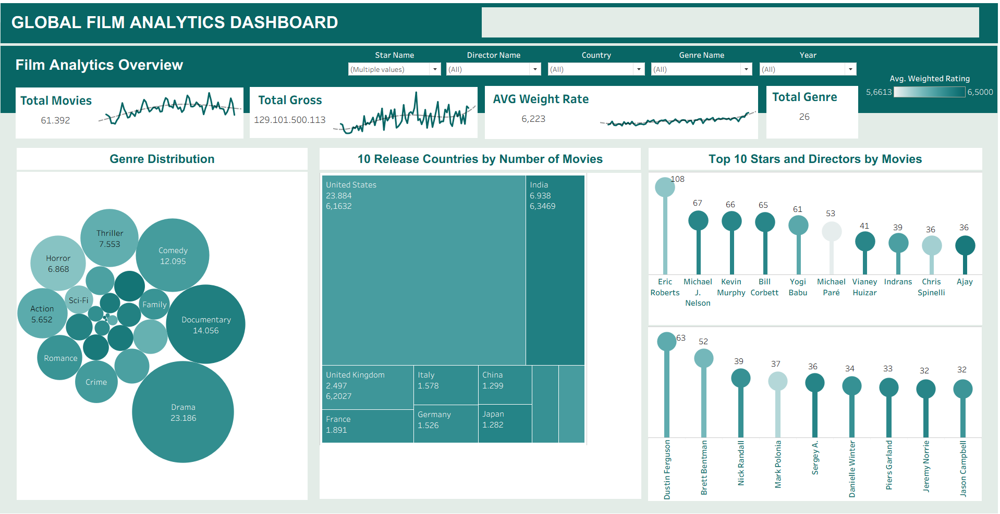
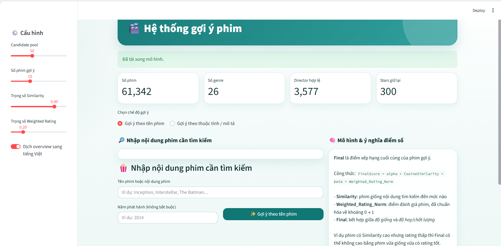

# 🎬 IMDb Movie Trends Analytics & Content-Based Recommendation System


## 📌 Giới thiệu dự án
Dự án này tập trung phân tích xu hướng điện ảnh giai đoạn 2020-2025 dựa trên bộ dữ liệu hơn 63.000 bản ghi từ nền tảng IMDb. Dự án được triển khai nhằm giải quyết hai bài toán chính: trực quan hóa thị trường điện ảnh và xây dựng hệ thống gợi ý phim (Content-Based Filtering).
  
## WorkFlow của dự án 


## 🎯 Các tính năng nổi bật
* **Phân tích thị trường (Data Analytics):** Xây dựng 5 dashboard trực quan hóa dữ liệu theo thời gian, thể loại, quốc gia, đạo diễn và diễn viên.
* **Hệ thống gợi ý phim (Recommender System):** Ứng dụng mô hình ngôn ngữ lớn SBERT để xử lý ngữ nghĩa phần tóm tắt phim. Sử dụng thuật toán KNN và độ đo Cosine Similarity để truy xuất phim tương đồng.
* **Cơ chế xếp hạng lại (Hybrid Reranking):** Kết hợp độ tương đồng nội dung và chỉ số Weighted Rating (chất lượng đánh giá) để đưa ra Top 10 phim gợi ý tối ưu nhất.
* **Triển khai (Deployment):** Ứng dụng web tương tác được xây dựng bằng Streamlit, cho phép tìm kiếm phim bằng tên hoặc truy vấn tự do.

## 🛠️ Công nghệ sử dụng
* **Thu thập dữ liệu:** Python (Selenium, BeautifulSoup, Requests).
* **Xử lý dữ liệu:** Pandas, NumPy.
* **Trực quan hóa:** Tableau.
* **Machine Learning:** Scikit-learn, Sentence-Transformers (SBERT).
* **Triển khai:** Streamlit.

## 🗂️ Mô tả bộ dữ liệu (Dataset Overview)
Bộ dữ liệu sử dụng trong dự án được thu thập từ IMDb, bao gồm 14 trường thông tin chính. Dưới đây là từ điển dữ liệu (Data Dictionary) sau khi đã được mô tả ngắn gọn:

| STT | Tên cột | Kiểu dữ liệu | Mô tả |
|:---:|---|:---:|---|
| 1 | **ID** | String | Mã định danh duy nhất của mỗi bộ phim. |
| 2 | **Movie_Title** | String | Tên bộ phim (định danh cơ bản dùng cho tìm kiếm và dashboard). |
| 3 | **Link** | String | Đường dẫn URL đến trang gốc của phim trên IMDb. |
| 4 | **Released_Date** | String | Ngày phát hành (dữ liệu thô có thể chứa cả thông tin quốc gia). |
| 5 | **Released_Year** | Integer | Năm phát hành phim (dùng để phân tích xu hướng theo thời gian). |
| 6 | **Countries_of_origin** | String | Quốc gia sản xuất/gốc của phim (ngăn cách bởi dấu `\|`). |
| 7 | **Genre** | String | Thể loại phim (ngăn cách bởi dấu `\|`). |
| 8 | **Runtime** | String | Thời lượng phim ở định dạng chuỗi văn bản (VD: 1h 54m). |
| 9 | **IMDB_Rating** | Float | Điểm số đánh giá trung bình trên IMDb (thang điểm 0–10). |
| 10 | **No_of_votes** | String | Số lượt đánh giá (chứa các ký hiệu rút gọn như K, M). |
| 11 | **Director** | String | Danh sách đạo diễn (ngăn cách bởi dấu `\|`). |
| 12 | **Stars** | String | Danh sách các diễn viên chính (ngăn cách bởi dấu `\|`). |
| 13 | **Gross** | String | Doanh thu phim dưới dạng chuỗi tiền tệ (VD: $9,458,590). |
| 14 | **Overview** | String | Tóm tắt nội dung phim. Đây là trường văn bản quan trọng dùng làm đầu vào cho mô hình SBERT. |

## 📊 1. Trực quan hóa dữ liệu (Dashboards)
Dự án cung cấp cái nhìn toàn cảnh và chi tiết về thị trường phim thông qua các phân tích về quy mô, doanh thu, điểm đánh giá và cơ cấu thể loại.

**🔗 [Xem Dashboard tại đây](https://public.tableau.com/app/profile/ng.c.nhi.ng/viz/TranLeDiemMy_DangNgocNhi/Story1)**



## 🤖 2. Hệ thống gợi ý phim (Recommendation Engine)
Kiến trúc hệ thống được chia làm 2 giai đoạn chính:
1. **Truy xuất ứng viên (Retrieval):** Mã hóa Multi-hot cho các thuộc tính phân loại (thể loại, đạo diễn, diễn viên, quốc gia) và SBERT cho văn bản. Lọc top 50 ứng viên gần nhất bằng KNN.
2. **Xếp hạng lại (Reranking):** Sắp xếp lại danh sách ứng viên dựa trên điểm tổng hợp `FinalScore` với trọng số: 80% độ tương đồng nội dung (Similarity) và 20% chất lượng phim (Weighted Rating).



**Ví dụ về kết quả đầu ra:**
Khi người dùng nhập vào phim *"The Batman"*, hệ thống sẽ trả về top 10 bộ phim có nội dung và thể loại tương đồng nhất.

```python
# Ví dụ kết quả của mô hình
Phim đầu vào: The Batman
Top 10 phim gợi ý:
1. Hilo 3
2. Nobody
3. Batman: The Long Halloween
4. Vettaiyan
5. Unidentified
6. Luther: The Fallen Sun
7. Common Creed: Trafficking
...
```

## 📂 Cấu trúc thư mục (Repository Structure)
```text
├── data/
│   ├── raw/                 # Dữ liệu cào từ IMDb ban đầu
│   └── processed/           # Dữ liệu sau khi làm sạch 
├── notebooks/
│   ├── 01. Thu thập dữ liệu.ipynb
│   ├── 02_Tiền xử lý dữ liệu.ipynb
│   ├── 03_Vẽ chart.ipynb
│   └── 04_Hệ thống đề xuất.ipynb
├── movie_streamlit_app/
│   └── app_movie_recommender.py               # Source code giao diện Streamlit
├── assets/
│   └── ...                  # Hình ảnh minh họa cho README
├── requirements.txt
└── README.md
